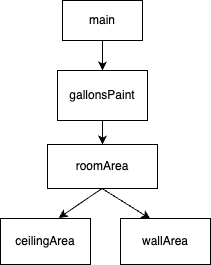

You will implement methods in the `PaintCalculator` class to compute the gallons
of paint needed to paint a rectangular room. The dimensions are given as length, width, and height.

The amount of paint depends on the total surface area of 
the room, which is computed as the sum of the ceiling area and the wall area.

The structure chart below shows the problem divided into 4 tasks, each
implemented in a separate method. You will use a bottom up approach to solve
this problem.

- Task 1: `ceilingArea` method
- Task 2: `wallArea` method
- Task 3: `roomArea` method
- Task 4: `gallonsPaint` method
- Task 5: `main` method command line interface

