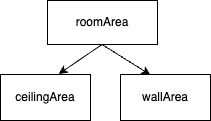

Assume the ceiling and walls will be painted the same color.

 

| Test Cases                | Expected Result | Expected Calls                                         |
|---------------------------|--------|--------------------------------------------------------|
| roomArea(12.0, 15.0, 10.0)  | 720.0  | ceilingArea(12.0, 15.0)  + wallArea(12.0, 15.0, 10.0)  |
| roomArea(7.5, 11.5, 8.25) | 399.75 | ceilingArea(7.5, 11.5)  + wallArea(7.5, 11.5, 8.25) |

- Add a new method named `roomArea` to compute the combined area of the ceiling and four walls.
  The `roomArea` method should directly call the `ceilingArea` and `wallArea` methods. 
    

    Algorithm: 
    (1) Call <code>ceilingArea</code> method and store the result in a local variable 
    (2) Call <code>wallArea</code> method and store the result in a local variable 
    (3) Return the sum of the two local variables 
    You can also just return the sum of the two method calls without using
    local variables, but local variables can make debugging easier.
    

- Edit `main` to print the result of calling `roomArea` for each test case listed.
- Run the program and confirm the expected result.
- Check your solution to proceed to the next task.